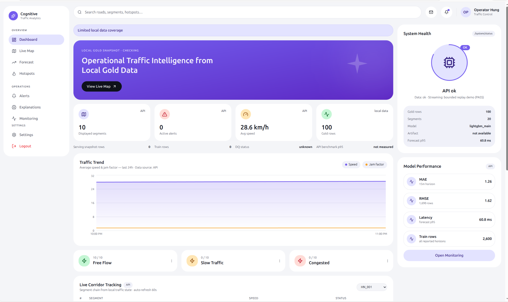
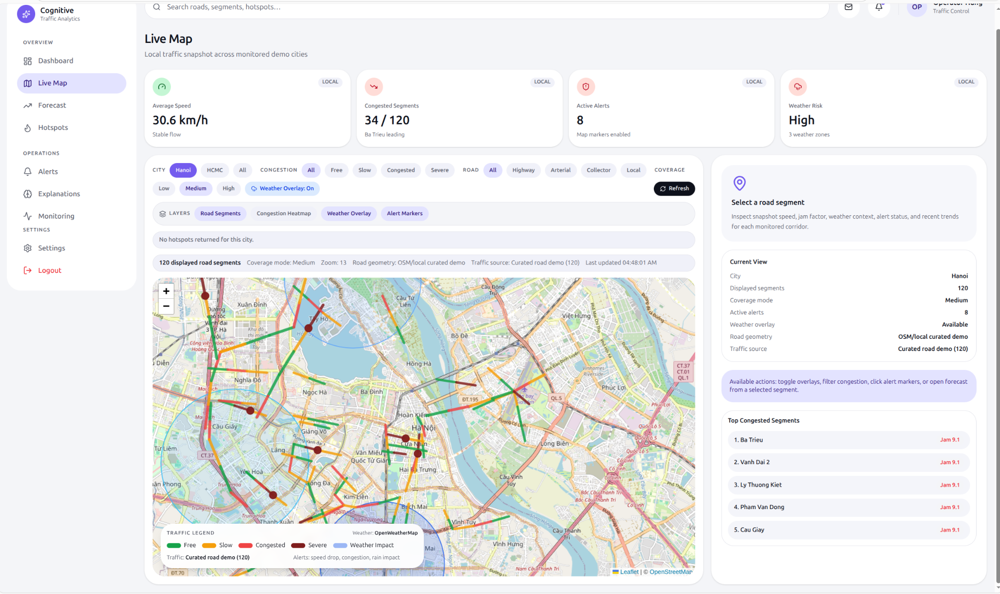
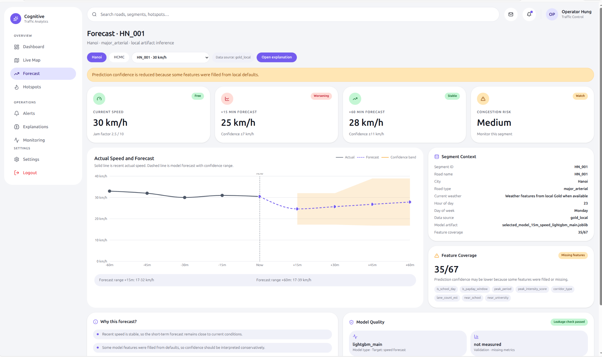
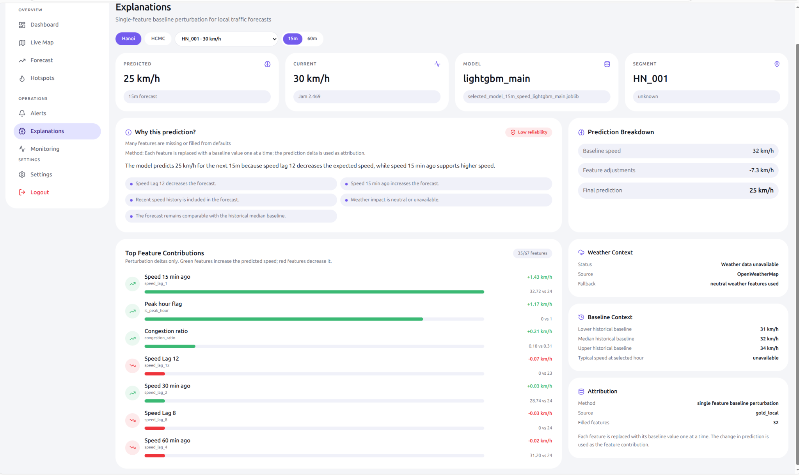

# Cognitive Traffic Analytics Platform

## 1. Tổng quan dự án

**Cognitive Traffic Analytics Platform** là hệ thống phân tích giao thông thông minh, hỗ trợ theo dõi tình trạng giao thông, xem bản đồ lưu lượng, phát hiện điểm nóng ùn tắc, dự báo tốc độ di chuyển và giải thích kết quả dự đoán của mô hình.

Ứng dụng được thiết kế cho vai trò điều phối / giám sát giao thông. Người dùng có thể mở dashboard để xem tổng quan hệ thống, theo dõi các tuyến đường trên bản đồ, kiểm tra các khu vực đang ùn tắc, xem dự báo trong ngắn hạn và kiểm tra trạng thái vận hành của pipeline dữ liệu.

Các chức năng chính:

- Theo dõi tổng quan tình trạng giao thông từ dữ liệu đã xử lý.
- Hiển thị bản đồ các đoạn đường, trạng thái lưu thông và lớp phủ thời tiết.
- Dự báo tốc độ giao thông theo từng đoạn đường.
- Phát hiện và hiển thị các cụm ùn tắc / điểm nóng giao thông.
- Giải thích lý do mô hình đưa ra dự báo.
- Theo dõi trạng thái dữ liệu, mô hình, API và pipeline.
- Cung cấp API phục vụ dashboard và các tác vụ inference.

---

## 2. Giao diện ứng dụng

### 2.1. Dashboard tổng quan

Dashboard tổng quan hiển thị nhanh trạng thái hiện tại của hệ thống: số đoạn đường đang theo dõi, cảnh báo đang hoạt động, tốc độ trung bình, số dòng dữ liệu Gold, trạng thái API, mô hình và độ trễ dự báo.



Các thông tin chính:

- Số lượng đoạn đường đang hiển thị.
- Số cảnh báo đang hoạt động.
- Tốc độ trung bình.
- Số dòng dữ liệu Gold.
- Trạng thái API và dữ liệu.
- Hiệu năng mô hình và độ trễ dự báo.
- Biểu đồ xu hướng tốc độ và jam factor.

---

### 2.2. Live Map

Màn hình **Live Map** hiển thị các đoạn đường trên bản đồ, phân loại theo mức độ lưu thông như free flow, slow, congested hoặc severe. Người dùng có thể lọc theo thành phố, mức độ ùn tắc, loại đường và lớp dữ liệu hiển thị.



Các chức năng chính:

- Xem các đoạn đường được giám sát trên bản đồ.
- Bật / tắt lớp phủ thời tiết.
- Lọc theo mức độ ùn tắc.
- Xem danh sách các đoạn đường ùn tắc nhiều nhất.
- Chọn một đoạn đường để kiểm tra thông tin chi tiết.
- Mở dự báo cho đoạn đường được chọn.

---

### 2.3. Forecast

Màn hình **Forecast** hiển thị dự báo tốc độ trong ngắn hạn cho một đoạn đường cụ thể. Giao diện cho phép chọn thành phố, chọn segment và xem tốc độ hiện tại, dự báo sau 15 phút, dự báo sau 60 phút và mức độ rủi ro ùn tắc.



Các thông tin chính:

- Tốc độ hiện tại.
- Dự báo tốc độ sau 15 phút.
- Dự báo tốc độ sau 60 phút.
- Mức độ rủi ro ùn tắc.
- Biểu đồ so sánh tốc độ thực tế và tốc độ dự báo.
- Thông tin ngữ cảnh của đoạn đường.
- Mức độ đầy đủ của feature dùng cho dự báo.

---

### 2.4. Hotspots

Màn hình **Hotspots** hiển thị các cụm ùn tắc đang hoạt động. Hệ thống nhóm các đoạn đường có dấu hiệu ùn tắc thành cluster để người dùng dễ theo dõi theo khu vực.


Các chức năng chính:

- Hiển thị số lượng hotspot đang hoạt động.
- Phân loại cụm ùn tắc theo mức độ nghiêm trọng.
- Hiển thị bản đồ phân bố hotspot.
- Xem danh sách các cluster đang hoạt động.
- Kiểm tra số đoạn đường bị ảnh hưởng trong từng cluster.
- Mở nhanh Live Map hoặc Forecast từ một cụm ùn tắc.

---

### 2.5. Explanations

Màn hình **Explanations** giúp giải thích vì sao mô hình đưa ra một kết quả dự báo nhất định. Hệ thống hiển thị tốc độ dự báo, tốc độ hiện tại, mô hình được sử dụng và các feature có ảnh hưởng tới dự đoán.



Các thông tin chính:

- Kết quả dự báo của mô hình.
- Tốc độ hiện tại của đoạn đường.
- Mô hình đang được sử dụng.
- Phân tích các feature ảnh hưởng tới kết quả.
- Bối cảnh thời tiết nếu có.
- Baseline context và prediction breakdown.

---

### 2.6. Monitoring

Màn hình **Monitoring** hiển thị trạng thái vận hành của ứng dụng, bao gồm trạng thái API, dữ liệu Gold, artifact mô hình, độ mới dữ liệu, trạng thái pipeline và các thành phần liên quan.


Các thông tin chính:

- Trạng thái API.
- Trạng thái dữ liệu Gold.
- Trạng thái model artifact.
- Độ mới dữ liệu.
- Trạng thái pipeline.
- Trạng thái data quality.
- Thông tin benchmark và bounded replay nếu có.

---

## 3. Kiến trúc hệ thống

Hệ thống gồm ba phần chính: pipeline dữ liệu, backend API và dashboard giao thông.


Luồng xử lý tổng quát:

```text
Traffic / Weather / Event Data
        ↓
Bronze Data
        ↓
Silver Cleaned Data
        ↓
Gold Analytics Data
        ↓
Model Training / API Serving
        ↓
React Dashboard
```

### Data Pipeline

Pipeline chịu trách nhiệm đọc dữ liệu đầu vào, làm sạch, chuẩn hóa và tạo dữ liệu phục vụ dashboard. Dữ liệu được tổ chức theo các tầng:

- **Bronze**: dữ liệu ban đầu hoặc dữ liệu mới được chuẩn hóa bước đầu.
- **Silver**: dữ liệu đã làm sạch, chuẩn hóa timestamp và schema.
- **Gold**: dữ liệu đã tổng hợp, dùng cho dashboard, forecast và model training.

### Backend API

FastAPI cung cấp các endpoint để dashboard truy vấn dữ liệu, kiểm tra trạng thái hệ thống và lấy kết quả dự báo.

Một số nhóm API chính:

- System status.
- Dashboard summary.
- Traffic forecast.
- Model status.
- Graph status.
- Evidence / monitoring data.

### Frontend Dashboard

Frontend là giao diện chính của ứng dụng, được xây dựng để người dùng theo dõi và thao tác với dữ liệu giao thông.

Các màn hình chính:

- Dashboard.
- Live Map.
- Forecast.
- Hotspots.
- Alerts.
- Explanations.
- Monitoring.
- Settings.

---

## 4. Công nghệ sử dụng

| Nhóm | Công nghệ |
|---|---|
| Data Processing | Python, pandas, Parquet |
| Orchestration | Apache Airflow |
| Streaming Demo | Kafka |
| Backend API | FastAPI |
| Frontend | React / Vite |
| Machine Learning | Scikit-learn, LightGBM |
| Model Tracking | MLflow |
| Graph Analytics | Neo4j |
| Cache / Local Service | Redis |
| Containerization | Docker, Docker Compose |
| Reports | JSON / Markdown reports |

---

## 5. Cấu trúc thư mục dự án

```text
cognitive-traffic-analytics/
├── raw/                         # Dữ liệu nguồn ban đầu
├── data/                        # Dữ liệu sau xử lý
│   ├── bronze/                  # Dữ liệu ban đầu / chuẩn hóa bước đầu
│   ├── silver/                  # Dữ liệu đã làm sạch
│   └── gold/                    # Dữ liệu phục vụ dashboard và mô hình
├── pipelines/                   # Pipeline xử lý dữ liệu
│   ├── streaming/               # Kafka bounded replay demo
│   ├── transformation/          # Xử lý raw -> silver -> gold
│   └── quality/                 # Kiểm tra chất lượng dữ liệu
├── api/                         # FastAPI backend
├── frontend/                    # React dashboard
├── ml/                          # Huấn luyện và theo dõi mô hình
├── models/                      # Model artifacts và metadata
├── graph/                       # Neo4j graph analytics
├── dags/                        # Airflow DAGs
├── monitoring/                  # Cấu hình monitoring nếu có
├── reports/                     # Báo cáo pipeline, DQ, benchmark
├── docs/                        # Tài liệu chi tiết
├── images/                      # Ảnh minh họa README
├── tests/                       # Unit test và smoke test
├── docker-compose.yml
├── Makefile
├── requirements.txt
└── README.md
```

---

## 6. Hướng dẫn cài đặt

### 6.1. Clone repository

```bash
git clone <repository-url>
cd cognitive-traffic-analytics
```

### 6.2. Tạo môi trường Python

```bash
python -m venv .venv
source .venv/bin/activate
pip install -r requirements.txt
```

Trên Windows PowerShell:

```powershell
.venv\Scripts\Activate.ps1
pip install -r requirements.txt
```

### 6.3. Tạo file môi trường

```bash
cp .env.example .env
```

Ví dụ cấu hình:

```env
TOMTOM_API_KEY=your_tomtom_api_key
OPENWEATHER_API_KEY=your_openweather_api_key

POSTGRES_USER=postgres
POSTGRES_PASSWORD=postgres
POSTGRES_DB=traffic_db

MLFLOW_TRACKING_URI=http://localhost:5000
```

### 6.4. Khởi động local stack

```bash
make up
```

Hoặc:

```bash
docker compose up -d
```

Kiểm tra trạng thái container:

```bash
docker compose ps
```

---

## 7. Chạy ứng dụng

### 7.1. Chạy pipeline dữ liệu

```bash
make pipeline
```

Pipeline tạo dữ liệu phục vụ dashboard và mô hình:

```text
raw data -> bronze -> silver -> gold
```

### 7.2. Kiểm tra chất lượng dữ liệu

```bash
make dq-check
```

Report chi tiết được lưu trong:

```text
reports/
docs/
```

### 7.3. Huấn luyện mô hình

```bash
make train
```

Thông tin model và artifact được lưu trong:

```text
models/
reports/
```

### 7.4. Chạy backend API

```bash
uvicorn api.main:app --host 0.0.0.0 --port 8000 --reload
```

Swagger UI:

```text
http://localhost:8000/docs
```

### 7.5. Chạy frontend dashboard

```bash
cd frontend
npm install
npm run dev
```

Truy cập dashboard:

```text
http://localhost:5173
```

---

## 8. Các màn hình chính

| Màn hình | Chức năng |
|---|---|
| Dashboard | Tổng quan tình trạng giao thông, hệ thống, model và dữ liệu |
| Live Map | Hiển thị bản đồ đoạn đường, lớp phủ thời tiết và trạng thái ùn tắc |
| Forecast | Dự báo tốc độ theo segment và horizon |
| Hotspots | Hiển thị các cụm ùn tắc đang hoạt động |
| Alerts | Theo dõi và xử lý cảnh báo giao thông |
| Explanations | Giải thích các yếu tố ảnh hưởng tới dự báo |
| Monitoring | Theo dõi trạng thái API, dữ liệu, pipeline và model |
| Settings | Cấu hình giao diện và tuỳ chọn ứng dụng |

---

## 9. Các service và URL quan trọng

| Dịch vụ | URL | Ghi chú |
|---|---|---|
| Traffic Dashboard | `http://localhost:5173` | Giao diện chính |
| FastAPI Docs | `http://localhost:8000/docs` | API documentation |
| Airflow UI | `http://localhost:8088` | `admin / admin` |
| Kafka Bootstrap | `localhost:9092` | Không có UI trong compose hiện tại |
| Redis CLI | `docker exec -it big-data-redis-1 redis-cli` | Kiểm tra cache/local service |
| Neo4j Browser | `http://localhost:7474` | `neo4j / password` |
| MLflow UI | `http://localhost:5000` | Theo dõi experiment |
| MinIO Console | `http://localhost:9001` | Optional lakehouse profile |
| Trino UI | `http://localhost:8888` | Optional lakehouse profile |

---

## 10. Các lệnh Makefile chính

```bash
make up              # Khởi động local stack
make down            # Dừng local stack
make pipeline        # Chạy pipeline xử lý dữ liệu
make dq-check        # Kiểm tra chất lượng dữ liệu
make stream-test     # Chạy Kafka bounded replay demo
make train           # Huấn luyện model
make mlflow-test     # Kiểm tra MLflow tracking
make neo4j-import    # Import graph vào Neo4j
make graph-test      # Kiểm tra graph
make api-smoke       # Kiểm tra API
make benchmark       # Benchmark API
make frontend-smoke  # Kiểm tra frontend
make test            # Chạy test
make ci-local        # Chạy pipeline + DQ + test + frontend
```