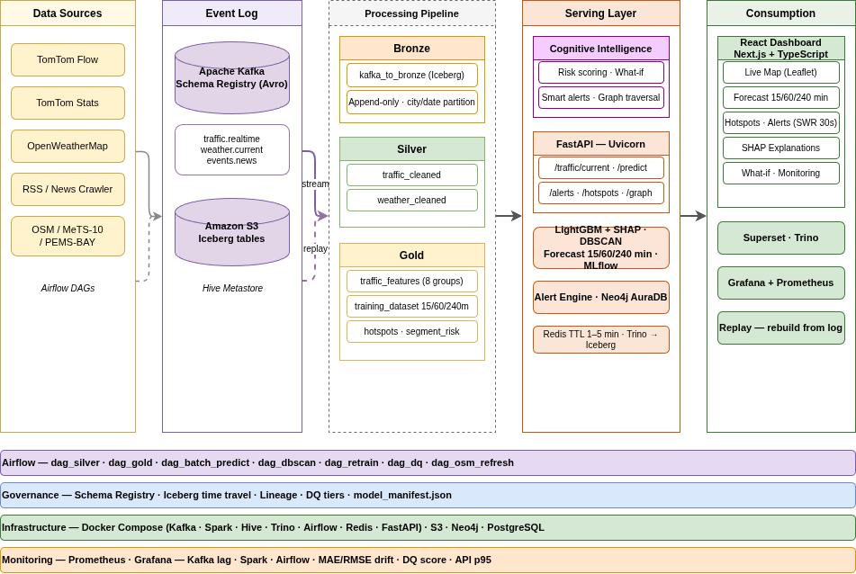
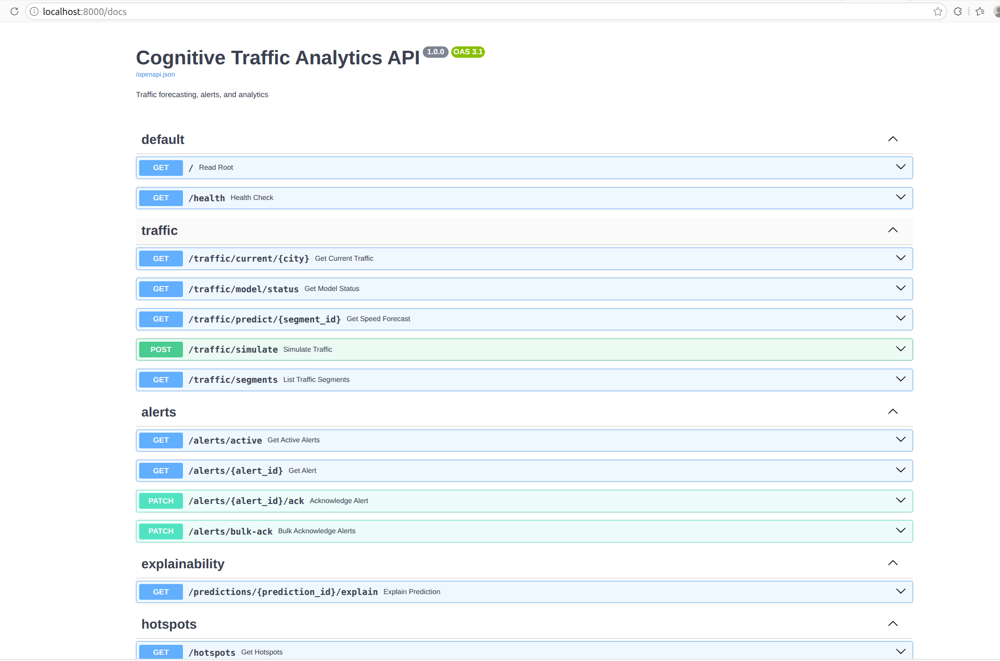
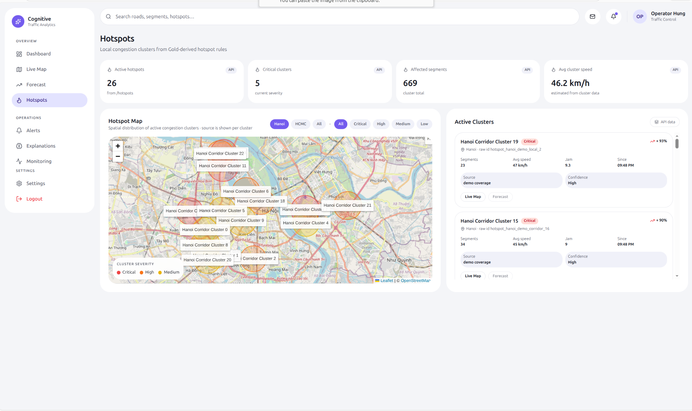
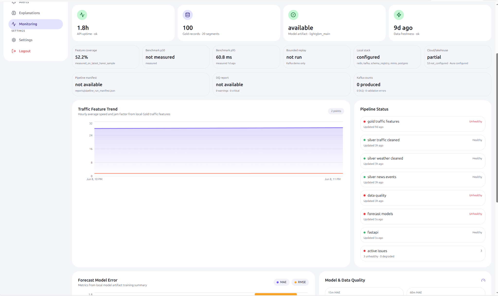
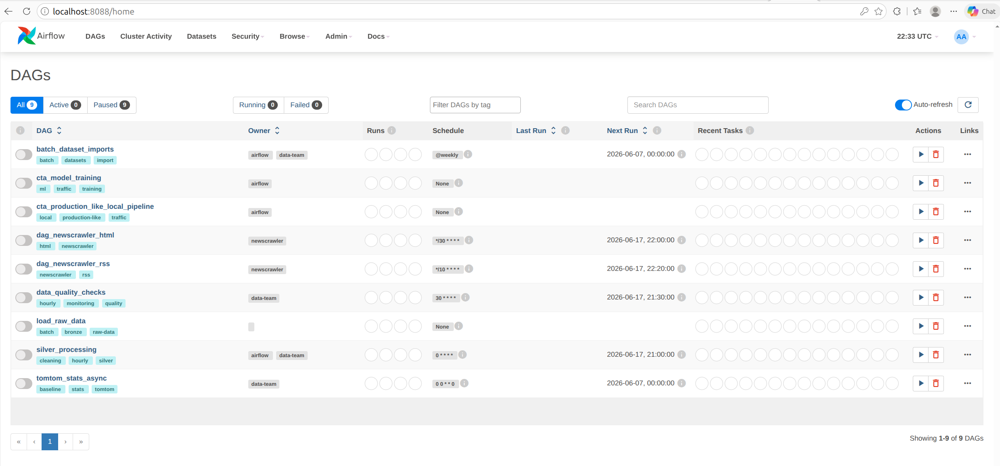
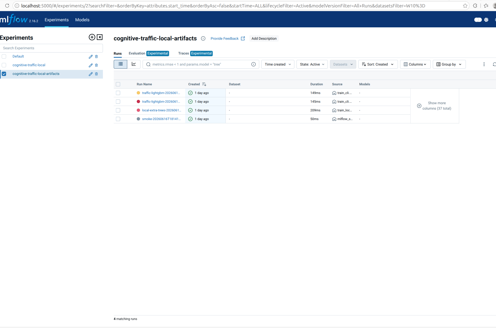
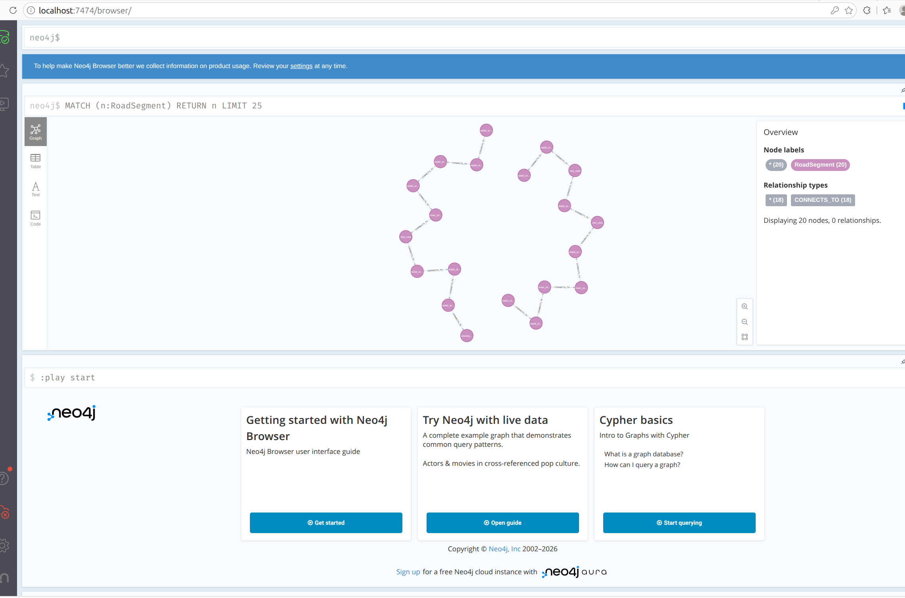

# Cognitive Traffic Analytics Platform

## 1. Tổng quan dự án

**Cognitive Traffic Analytics Platform** là hệ thống phân tích giao thông thông minh, hỗ trợ theo dõi, xử lý, dự báo và trực quan hóa tình trạng giao thông đô thị.

Ứng dụng được thiết kế cho vai trò điều phối / giám sát giao thông. Người dùng có thể quan sát tổng quan hệ thống, xem bản đồ các đoạn đường, phát hiện điểm nóng ùn tắc, theo dõi cảnh báo, xem dự báo tốc độ trong ngắn hạn và kiểm tra trạng thái vận hành của pipeline dữ liệu.

Các chức năng chính:

- Theo dõi tổng quan tình trạng giao thông trên dashboard.
- Hiển thị bản đồ các đoạn đường đang được giám sát.
- Phân loại trạng thái lưu thông: free flow, slow, congested, severe.
- Dự báo tốc độ giao thông theo từng đoạn đường.
- Phát hiện các cụm ùn tắc / hotspot theo khu vực.
- Hiển thị cảnh báo giao thông và trạng thái xử lý.
- Giải thích các yếu tố ảnh hưởng tới kết quả dự báo.
- Theo dõi trạng thái API, dữ liệu, mô hình và pipeline.

---

## 2. Kiến trúc hệ thống

Hệ thống được thiết kế theo kiến trúc nhiều thành phần, gồm pipeline xử lý dữ liệu, backend API, mô hình dự báo và dashboard giao thông.



*Sơ đồ kiến trúc tổng quan của hệ thống Cognitive Traffic Analytics Platform.*

### Các thành phần chính

**Data Pipeline:**

- **Raw Data**: Dữ liệu giao thông, thời tiết và sự kiện đầu vào.
- **Bronze Layer**: Lưu dữ liệu ban đầu hoặc dữ liệu mới được chuẩn hóa bước đầu.
- **Silver Layer**: Lưu dữ liệu đã làm sạch, chuẩn hóa thời gian và schema.
- **Gold Layer**: Lưu dữ liệu đã tổng hợp, phục vụ dashboard, forecast và model training.
- **Data Quality Check**: Kiểm tra dữ liệu trước khi sử dụng cho dashboard và mô hình.
- **Airflow**: Điều phối pipeline xử lý dữ liệu ở chế độ local.
- **Kafka**: Hỗ trợ bounded replay demo cho luồng dữ liệu streaming.
- **Redis**: Lưu dữ liệu truy cập nhanh cho API nếu được cấu hình.
- **Neo4j**: Hỗ trợ graph analytics cho các đoạn đường và quan hệ giữa chúng.

**Application & Model Serving:**

- **FastAPI**: Cung cấp API cho dashboard, forecast, monitoring và trạng thái hệ thống.
- **React / Vite Dashboard**: Giao diện chính để người dùng quan sát dữ liệu giao thông.
- **Scikit-learn / LightGBM**: Huấn luyện mô hình dự báo tốc độ giao thông.
- **MLflow**: Theo dõi quá trình huấn luyện mô hình khi tracking server được bật.
- **Docker Compose**: Khởi chạy các service local của hệ thống.

---

## 3. Yêu cầu hệ thống

- **Docker Desktop** và **Docker Compose**.
- **Python 3.9+**.
- **Node.js 18+** để chạy frontend dashboard.
- **Hệ điều hành**: Windows, macOS hoặc Linux.
- **RAM khuyến nghị**: 8GB trở lên.
- **Kết nối Internet** để tải Docker images và dependencies.

Kiểm tra các công cụ cần thiết:

```bash
docker --version
docker compose version
python --version
pip --version
node --version
npm --version
````

---

## 4. Repository Structure

```text
cognitive-traffic-analytics/
├── .github/                     # CI workflows
├── airflow/                     # Airflow DAGs for local orchestration
├── api/                         # FastAPI backend and services
├── frontend/                    # React / Vite dashboard
├── pipelines/                   # Ingestion, streaming, transformation, quality workflows
│   ├── ingestion/               # Source producers and batch importers
│   ├── processing/              # Bronze/Silver/Gold Spark-oriented jobs
│   ├── streaming/               # Kafka bounded replay demo
│   ├── transformation/          # Default local raw JSONL -> Bronze/Silver/Gold path
│   └── quality/                 # Data quality checks
├── domain/                      # Shared traffic intelligence and alert domain logic
├── ml/                          # Training, feature schema, MLflow tracking helpers
├── graph/                       # Optional Neo4j graph prototype
├── data/                        # Local raw/bronze/silver/gold data
│   ├── raw/                     # Source JSONL snapshots
│   ├── bronze/
│   ├── silver/
│   └── gold/
├── models/                      # Local model artifacts, model packs, metadata
├── reports/                     # Pipeline, DQ, benchmark, streaming evidence
├── docs/                        # Architecture, contracts, operations, assets
│   └── assets/                  # README and documentation images
├── infra/                       # Docker/local infrastructure and service config
├── scripts/                     # Utility scripts and one-off checks
├── tests/                       # Unit, smoke, and integration tests
├── config/                      # Runtime and pipeline configuration
├── docker-compose.yml
├── Makefile
├── requirements.txt
└── README.md
```

Default verified path: `data/raw/*.jsonl` -> `data/bronze` -> `data/silver` -> `data/gold` -> DQ report -> `models/` artifact -> FastAPI/dashboard.

---

## 5. Hướng dẫn cài đặt và triển khai

### 5.1. Thiết lập ban đầu

1. **Clone repository**

```bash
git clone <repository-url>
cd cognitive-traffic-analytics
```

2. **Tạo môi trường Python**

```bash
python -m venv .venv
source .venv/bin/activate
pip install -r requirements.txt
```

Trên Windows PowerShell:

```powershell
.venv\Scripts\Activate.ps1
pip install -r requirements.txt
```

3. **Tạo file cấu hình môi trường**

```bash
cp .env.example .env
```

Ví dụ các biến môi trường chính:

```env
TOMTOM_API_KEY=your_tomtom_api_key
OPENWEATHER_API_KEY=your_openweather_api_key

POSTGRES_USER=postgres
POSTGRES_PASSWORD=postgres
POSTGRES_DB=traffic_db

MLFLOW_TRACKING_URI=http://localhost:5000
```

4. **Khởi động local stack**

```bash
make up
```

Hoặc:

```bash
docker compose up -d
```

5. **Kiểm tra trạng thái container**

```bash
docker compose ps
```

---

### 5.2. Chuẩn bị dữ liệu và chạy pipeline

Pipeline dữ liệu chịu trách nhiệm đọc dữ liệu đầu vào, làm sạch, chuẩn hóa và tạo dữ liệu phục vụ dashboard.

Chạy pipeline:

```bash
make pipeline
```

Luồng xử lý chính:

```text
Traffic / Weather / Event Data
        ↓
Bronze Data
        ↓
Silver Cleaned Data
        ↓
Gold Analytics Data
        ↓
Dashboard / API / Model Training
```

Dữ liệu sau xử lý được lưu tại:

```text
data/bronze/
data/silver/
data/gold/
```

Trong đó:

* `bronze/`: lưu dữ liệu ban đầu.
* `silver/`: lưu dữ liệu đã làm sạch.
* `gold/`: lưu dữ liệu phục vụ dashboard, forecast và training.

---

### 5.3. Kiểm tra chất lượng dữ liệu

Trước khi dữ liệu được sử dụng cho dashboard hoặc mô hình, hệ thống chạy bước kiểm tra chất lượng dữ liệu.

Chạy kiểm tra:

```bash
make dq-check
```

Các nhóm kiểm tra chính:

* Kiểm tra cột bắt buộc.
* Kiểm tra dữ liệu thiếu.
* Kiểm tra dữ liệu trùng lặp.
* Kiểm tra thứ tự thời gian.
* Kiểm tra các giá trị bất thường.
* Kiểm tra dữ liệu đầu vào cho mô hình.

Report chi tiết được lưu trong:

```text
reports/
docs/
```

---

### 5.4. Khởi chạy backend API

FastAPI cung cấp API cho dashboard, forecast, monitoring và trạng thái hệ thống.

Chạy backend:

```bash
uvicorn api.main:app --host 0.0.0.0 --port 8000 --reload
```

Truy cập Swagger UI:

```text
http://localhost:8000/docs
```

Một số endpoint chính:

```text
/health
/system/status
/system/evidence
/dashboard/summary?city=hanoi
/traffic/predict/HN_005?horizon=15m
/model/status
/graph/status
```



---

### 5.5. Khởi chạy frontend dashboard

Dashboard là giao diện chính để người dùng quan sát và thao tác với hệ thống.

Chạy frontend:

```bash
cd frontend
npm install
npm run dev
```

Truy cập dashboard:

```text
http://localhost:5173
```


Dashboard gồm các màn hình chính:

* **Dashboard**: tổng quan trạng thái giao thông, API, model và dữ liệu.
* **Live Map**: bản đồ các đoạn đường đang được giám sát.
* **Forecast**: dự báo tốc độ theo đoạn đường.
* **Hotspots**: các cụm ùn tắc đang hoạt động.
* **Alerts**: cảnh báo giao thông.
* **Explanations**: giải thích kết quả dự báo.
* **Monitoring**: trạng thái hệ thống, dữ liệu và pipeline.
* **Settings**: cấu hình ứng dụng.

---

### 5.6. Live Map

Màn hình **Live Map** hiển thị các đoạn đường trên bản đồ, phân loại theo trạng thái lưu thông. Người dùng có thể lọc theo thành phố, mức độ ùn tắc, loại đường và lớp dữ liệu hiển thị.


Các chức năng chính:

* Xem các đoạn đường đang được giám sát trên bản đồ.
* Lọc theo mức độ ùn tắc.
* Bật / tắt lớp phủ thời tiết.
* Xem danh sách các đoạn đường ùn tắc nhiều nhất.
* Chọn đoạn đường để kiểm tra thông tin chi tiết.
* Mở nhanh màn hình dự báo cho đoạn đường được chọn.

---

### 5.7. Forecast

Màn hình **Forecast** hiển thị dự báo tốc độ trong ngắn hạn cho một đoạn đường cụ thể.


Các thông tin chính:

* Tốc độ hiện tại.
* Dự báo sau 15 phút.
* Dự báo sau 60 phút.
* Mức độ rủi ro ùn tắc.
* Biểu đồ tốc độ thực tế và tốc độ dự báo.
* Thông tin ngữ cảnh của đoạn đường.
* Mức độ đầy đủ của feature dùng cho dự báo.

---

### 5.8. Hotspots

Màn hình **Hotspots** hiển thị các cụm ùn tắc đang hoạt động. Hệ thống nhóm các đoạn đường có dấu hiệu ùn tắc để người dùng dễ theo dõi theo khu vực.



Các chức năng chính:

* Hiển thị số lượng hotspot đang hoạt động.
* Phân loại cụm ùn tắc theo mức độ nghiêm trọng.
* Hiển thị bản đồ phân bố hotspot.
* Xem danh sách các cluster đang hoạt động.
* Kiểm tra số đoạn đường bị ảnh hưởng trong từng cluster.
* Mở nhanh Live Map hoặc Forecast từ một cụm ùn tắc.

---

### 5.9. Explanations

Màn hình **Explanations** giúp giải thích vì sao mô hình đưa ra một kết quả dự báo nhất định.


Các thông tin chính:

* Kết quả dự báo.
* Tốc độ hiện tại.
* Mô hình đang được sử dụng.
* Các feature ảnh hưởng tới dự báo.
* Bối cảnh thời tiết nếu có.
* Baseline context và prediction breakdown.

---

### 5.10. Monitoring

Màn hình **Monitoring** hiển thị trạng thái vận hành của ứng dụng.



Các thông tin chính:

* Trạng thái API.
* Trạng thái dữ liệu Gold.
* Trạng thái model artifact.
* Độ mới dữ liệu.
* Trạng thái pipeline.
* Trạng thái data quality.
* Thông tin benchmark và bounded replay nếu có.

---

### 5.11. Luồng streaming với Kafka

Kafka được dùng để mô phỏng luồng dữ liệu streaming / bounded replay trong hệ thống.

Chạy streaming demo:

```bash
make stream-test
```

Luồng streaming:

```text
Data Source
    ↓
Kafka Producer
    ↓
Kafka Topic
    ↓
Kafka Consumer
    ↓
Processed Data
```

Kafka bootstrap:

```text
localhost:9092
```

---

### 5.12. Điều phối pipeline bằng Airflow

Airflow được dùng để quản lý và điều phối các bước xử lý dữ liệu.

Truy cập Airflow UI:

```text
http://localhost:8088
```

Credentials:

```text
admin / admin
```

DAG chính:

```text
dag_production_like_local_pipeline
```

DAG thực hiện:

* Chuẩn bị dữ liệu đầu vào.
* Chạy pipeline xử lý dữ liệu.
* Kiểm tra chất lượng dữ liệu.
* Tạo dữ liệu phục vụ dashboard.
* Ghi report sau khi chạy.



---

### 5.13. Huấn luyện mô hình

Dữ liệu sau xử lý được dùng để huấn luyện mô hình dự báo tốc độ hoặc tình trạng ùn tắc.

Chạy huấn luyện:

```bash
make train
```

Hoặc:

```bash
python -m ml.training.train_cli
```

Mô hình sử dụng các nhóm thông tin:

* Tốc độ hiện tại.
* Tốc độ tự do.
* Mức độ ùn tắc.
* Thời gian trong ngày.
* Ngày trong tuần.
* Dữ liệu thời tiết.
* Dữ liệu trễ theo thời gian.
* Dữ liệu sự kiện liên quan.

Thông tin chi tiết được lưu trong:

```text
models/
reports/
docs/
```

---

### 5.14. Theo dõi mô hình bằng MLflow

MLflow được dùng để theo dõi các lần huấn luyện mô hình.

Khởi động MLflow:

```bash
docker compose -f docker-compose.model-registry.yaml up -d
```

Hoặc chạy kiểm tra:

```bash
make mlflow-test
```

Truy cập MLflow UI:

```text
http://localhost:5000
```

MLflow hiển thị:

* Các lần chạy huấn luyện.
* Tham số mô hình.
* Metric đánh giá.
* Artifact của mô hình.
* Metadata của từng run.



---

### 5.15. Graph Analytics với Neo4j

Neo4j được dùng để lưu các đoạn đường và quan hệ giữa chúng dưới dạng graph.

Chạy import graph:

```bash
make neo4j-import
```

Chạy kiểm tra graph:

```bash
make graph-test
```

Truy cập Neo4j Browser:

```text
http://localhost:7474
```

Credentials:

```text
neo4j / password
```

Neo4j hỗ trợ:

* Lưu thông tin các đoạn đường.
* Biểu diễn quan hệ giữa các đoạn đường.
* Phân tích các đoạn đường có liên quan.
* Cung cấp dữ liệu cho graph endpoint trong API.



---

## 6. Các URLs quan trọng

| Dịch vụ           | URL                                          | Ghi chú                            |
| ----------------- | -------------------------------------------- | ---------------------------------- |
| Traffic Dashboard | `http://localhost:5173`                      | Giao diện chính                    |
| FastAPI Docs      | `http://localhost:8000/docs`                 | API documentation                  |
| Airflow UI        | `http://localhost:8088`                      | `admin / admin`                    |
| Kafka Bootstrap   | `localhost:9092`                             | Không có UI trong compose hiện tại |
| Redis CLI         | `docker exec -it big-data-redis-1 redis-cli` | Kiểm tra Redis                     |
| Neo4j Browser     | `http://localhost:7474`                      | `neo4j / password`                 |
| MLflow UI         | `http://localhost:5000`                      | Theo dõi experiment                |
| MinIO Console     | `http://localhost:9001`                      | Optional lakehouse profile         |
| Trino UI          | `http://localhost:8888`                      | Optional lakehouse profile         |

---

## 7. Các lệnh Makefile chính

```bash
make up              # Khởi động local stack
make down            # Dừng local stack
make pipeline        # Chạy pipeline xử lý dữ liệu
make dq-check        # Kiểm tra chất lượng dữ liệu
make stream-test     # Chạy Kafka bounded replay demo
make train           # Huấn luyện model
make mlflow-test     # Kiểm tra MLflow tracking
make neo4j-import    # Import graph vào Neo4j
make graph-test      # Kiểm tra graph
make api-smoke       # Kiểm tra API
make benchmark       # Benchmark API
make frontend-smoke  # Kiểm tra frontend
make test            # Chạy test
make ci-local        # Chạy pipeline + DQ + test + frontend
```

---

*Tài liệu này được cập nhật lần cuối vào: June 18, 2026*

