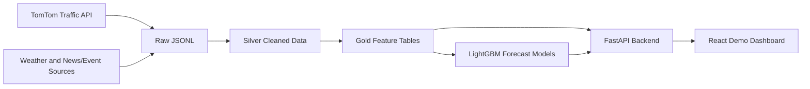

# Cognitive Traffic Analytics Platform for Smart Cities: A Prototype for Geospatial Traffic Monitoring and Short-Term Congestion Prediction

## Abstract

Urban traffic congestion creates economic, environmental, and public-safety costs for modern cities. Traffic management teams need platforms that can integrate heterogeneous data, monitor current road conditions, and expose predictive signals before congestion becomes severe. This report presents a prototype Cognitive Traffic Analytics Platform for Smart Cities, implemented as a local-first system for Hanoi traffic monitoring and short-term speed prediction. The prototype ingests TomTom Flow Segment snapshots and supporting weather/news/event sources into raw data files, transforms them into Silver and Gold data layers, preserves geospatial segment geometry, and exposes traffic analytics through a FastAPI backend and React dashboard. The current local Hanoi dataset contains approximately 75 monitored road segments with real geometry. The system provides dashboard metrics, GeoJSON map rendering, alert and hotspot endpoints, LightGBM speed forecasts for 15-minute and 60-minute horizons, and a predicted-hotspot endpoint based on model-predicted speed risk rules. In the current model bundle, the selected LightGBM models reach test MAE values of approximately 4.45 km/h for 15-minute speed prediction and 4.49 km/h for 60-minute speed prediction, with test R2 values around 0.888. The prototype demonstrates an end-to-end capstone-ready traffic analytics workflow, while remaining limited by partial Hanoi coverage, batch-oriented ingestion, partial feature filling during inference, and demo/static monitoring and explanation views.

## Keywords

Smart City, Traffic Analytics, Geospatial Data, Traffic Forecasting, LightGBM, Congestion Hotspot, Decision Support Dashboard

## I. Introduction

Traffic congestion is a persistent challenge in dense urban areas. Delays, unreliable travel time, and localized bottlenecks reduce transport efficiency and complicate road operations. Traditional traffic dashboards often focus on current state only, while operational decision support requires both situational awareness and predictive signals. A smart-city traffic platform should therefore integrate multiple data sources, process geospatial traffic observations, expose near-real-time road conditions, and identify congestion risk before it becomes critical.

This project, titled "Cognitive Traffic Analytics Platform for Smart Cities", implements a prototype for that objective. The current prototype focuses on Hanoi as a bounded demonstration area. It integrates TomTom Flow Segment traffic snapshots, local processing pipelines, model artifacts, and a web dashboard. The system is not production-ready and does not claim full-city coverage. Instead, it demonstrates the core engineering and analytics path expected for the capstone: data ingestion, local Silver/Gold processing, geospatial traffic visualization, short-term predictive analytics, and decision-support endpoints for current and predicted congestion.

The main contributions of the prototype are:

1. A local raw-to-Silver-to-Gold traffic data pipeline that cleans traffic snapshots, preserves geometry, derives time-series features, and builds model-ready datasets.
2. A FastAPI backend exposing dashboard, segment, alert, hotspot, forecast, and model-status endpoints.
3. A React/TanStack frontend, including a focused `/demo` route that walks through the real implemented prototype flow.
4. LightGBM speed prediction for 15-minute and 60-minute horizons using a selected model bundle.
5. A predicted-hotspot endpoint that converts speed forecasts into transparent congestion-risk candidates.

The system deliberately separates implemented functionality from demo/static elements. Monitoring, system health, and explanation views are currently illustrative and are treated as limitations or future work rather than production capabilities.

## II. Problem Statement and Objectives

The target problem is urban traffic intelligence for smart-city operations. A traffic management prototype should address five practical needs. First, heterogeneous traffic-related data must be collected and normalized. Second, geospatial traffic segments must be processed so that road conditions can be rendered on a map. Third, the platform should provide near-real-time visibility into speed, free-flow speed, jam factor, alerts, and hotspots. Fourth, predictive analytics should estimate future congestion risk rather than only reporting the present. Fifth, a dashboard should organize these signals for human decision support.

The objectives of this project are:

- Integrate traffic, weather, and traffic-news/event data sources in a local data workflow.
- Process TomTom geospatial traffic snapshots into clean Silver and Gold datasets.
- Provide current traffic analytics through API endpoints and a dashboard.
- Predict short-term traffic speed for 15-minute and 60-minute horizons.
- Identify predicted congestion hotspots from model outputs using transparent rules.
- Provide a reproducible Docker-based development and testing workflow.
- Provide a focused prototype demo that honestly distinguishes real data from demo/static components.

The scope is intentionally bounded. The current local dataset covers approximately 75 Hanoi road segments and 73 road names. It is suitable for a capstone prototype demonstration but not for full-city traffic management. Ingestion is currently batch/snapshot-oriented rather than a continuously operated streaming deployment. Model inference uses real Gold data but still fills part of the required feature vector for demo inference. Neo4j exists in the infrastructure stack but is not used in the primary demo flow.

## III. System Overview

The prototype uses a layered architecture. Data is first collected into raw JSONL snapshots. Local scripts then create cleaned traffic records in the Silver layer and traffic feature tables in the Gold layer. Model artifacts are loaded by the API layer to support speed prediction. A React frontend consumes API endpoints and presents the operator-facing workflow.

The main layers are:

- Ingestion layer: controlled collection from TomTom Flow Segment API, OpenWeather, and RSS/HTML traffic-news sources. The traffic demo uses TomTom as the primary source.
- Raw layer: JSONL snapshots under local raw folders.
- Silver layer: cleaned and deduplicated traffic/weather/event records.
- Gold layer: feature tables, current traffic metrics, target columns, and model-ready datasets.
- Model layer: LightGBM artifacts for 15-minute and 60-minute speed forecasting.
- Service layer: FastAPI endpoints for dashboard, segments, alerts, hotspots, forecasts, and model readiness.
- Frontend layer: React/TanStack dashboard with a focused demo flow, map, forecast, alert, and hotspot pages.
- Development layer: Docker Compose and Python 3.11 API/test containers.

The Docker Compose stack also includes Kafka, Schema Registry, Postgres, Redis, Neo4j, MinIO, Hive Metastore, Trino, and Airflow. These components represent the broader target architecture. In the current prototype state, the reliable demo path is the local raw/Silver/Gold pipeline and FastAPI/React application.

## IV. Data Sources and Processing Pipeline

The primary data source for the demo is the TomTom Flow Segment API. The project defines a bounded Hanoi sampling configuration in `config/hanoi_traffic_points.yaml`, currently containing 65 configured points across 14 districts. Each configured point represents one TomTom Flow Segment request. The ingestion script supports dry-run mode, city filtering, request limit, and offset selection. This allows quota-controlled collection without repeatedly crawling the same points.

Raw traffic records are stored as JSONL snapshots. Each TomTom record includes fields such as current speed, free-flow speed, jam factor, confidence, location, segment identifier, segment name, and available geometry. The local Gold builder then processes the raw files through these main steps:

1. Load raw traffic and weather JSONL files.
2. Convert timestamps to Asia/Ho_Chi_Minh local time.
3. Bucket timestamps at a fixed interval, currently five minutes.
4. Deduplicate traffic by city, segment ID, and time bucket.
5. Preserve geometry from raw TomTom responses when available.
6. Compute data continuity and quality indicators.
7. Add time features, lag features, rolling features, and traffic ratio features.
8. Join weather data using non-future bucket data.
9. Build target columns using exact future timestamp joins.
10. Export CSV and Parquet outputs for Silver and Gold datasets.

In the current local Gold data, `data/gold/cleaned_traffic_features.parquet` contains 3065 rows. Hanoi accounts for 2505 rows, 75 unique segments, and 73 road names. The Hanoi timestamp range in the current local dataset is approximately from 2026-05-14 12:10:03 to 2026-06-11 21:56:57. The latest Hanoi segment set contains 75 segments, all with non-null geometry, and no missing latest current speed or jam factor values. These numbers should be interpreted as local prototype coverage rather than full-city coverage.

Weather, news, and event pipelines exist in the project and support the broader heterogeneous-data requirement. However, the main UI demo is traffic-centered. Weather and event-derived context appears in model features and pipeline structure, but the final dashboard demonstration should not imply a fully productionized multi-source streaming deployment.

## V. Geospatial Traffic Analytics

The geospatial traffic analytics layer turns local Gold traffic features into operator-facing views. The backend endpoint `/segments/geojson?city=hanoi` returns segment geometry as GeoJSON for frontend map rendering. Geometry is derived from TomTom segment coordinates when present; synthetic geometry is only a fallback path in the segment router. In the current Hanoi demo dataset, latest geometry coverage is 75 out of 75 segments.

The system exposes the following current traffic indicators:

- `currentSpeed`: current observed segment speed.
- `freeFlowSpeed`: estimated free-flow speed for the same road segment.
- `jamFactor`: TomTom congestion indicator on a 0 to 10 scale.
- congestion categories: free, slow, and congested, derived from jam factor thresholds.
- active alerts: generated from latest segment rows whose jam factor exceeds a configured threshold.
- current hotspots: grouped congested segments exposed by `/hotspots?city=hanoi`.

These indicators support decision making by allowing an operator to answer several questions quickly: Which roads are monitored? Which segments are currently slow or congested? Where are the current hotspots? Which segments should be inspected on the map? The React Live Map page uses the GeoJSON endpoint and current hotspot endpoint to show the spatial distribution of congestion. If the API is unavailable, the frontend has explicit fallback labels, so fallback demo data is not silently presented as real API data.

## VI. Predictive Analytics Method

The predictive analytics component estimates future traffic speed for two horizons: 15 minutes and 60 minutes. The selected model family is LightGBM. The current default model bundle is located at `result/cta_training_outputs_balanced_v3_latest/`, and normal Git history should not be used for committing large model artifacts.

The selected artifacts are:

- `selected_model_15m_speed_lightgbm_main.joblib`
- `selected_model_60m_speed_lightgbm_main.joblib`

The model metadata indicates that the selected model for both horizons is `lightgbm_main`. The selection rule prefers LightGBM unless an ensemble improves validation MAE by a configured threshold. Evaluation metrics from `report_summary_selected_models.csv` are summarized in Table I.

| Task | Selected model | Validation MAE | Test MAE | Test RMSE | Test R2 |
|---|---:|---:|---:|---:|---:|
| 15m speed | LightGBM | 4.3235 | 4.4456 | 6.2053 | 0.8880 |
| 60m speed | LightGBM | 4.3825 | 4.4918 | 6.2111 | 0.8881 |

The leaderboard shows that ensemble models had slightly lower validation and test MAE, but the selected model remains LightGBM according to the selection policy. For example, the 15-minute ensemble test MAE is approximately 4.4365 km/h, while the selected LightGBM test MAE is approximately 4.4456 km/h. This difference is small, and the prototype uses LightGBM as the default model for explainability of implementation and deployment simplicity.

Feature importance files show that important model features include weather wind speed, humidity, pressure, speed rolling standard deviation, jam lags, free-flow speed, rain rolling sums, speed lags, current speed, jam factor, speed ratio, hour, and day-of-week features. This reflects a combination of weather context, recent traffic state, temporal context, and current segment conditions.

At inference time, `/traffic/predict/{segment_id}?horizon=15m` and `/traffic/predict/{segment_id}?horizon=60m` load the selected artifact, read the latest local Gold row for the segment, construct a model feature vector, and return predicted speed along with metadata. The response includes model name, artifact, data source, required feature count, available feature count, filled feature count, fallback flag, latest timestamp, and warning fields. This is important because the current local Gold data does not always contain every training feature. A typical demo segment can require partial feature filling, for example approximately 15 filled features out of 67 required features. Therefore, forecasts should be described as prototype model outputs, not production-grade forecasts.

The runtime dependency `scikit-learn` is pinned to `>=1.6.1,<1.7.0` to match the model artifact training environment and avoid artifact version mismatch warnings.

## VII. Predicted Congestion Hotspots

Predicted hotspots are implemented as a transparent risk layer over model-predicted speed. They are not a separate production-calibrated risk model. The endpoint `/hotspots/predicted?city=hanoi&horizon=15m` or `/hotspots/predicted?city=hanoi&horizon=60m` iterates over latest local traffic segments, calls the selected speed model, and returns segment-level predicted risk candidates.

A segment is flagged as a predicted hotspot if one or more of the following rules is satisfied:

- predicted speed is below 20 km/h,
- predicted speed divided by free-flow speed is below 0.5,
- predicted speed drops by more than 30 percent compared with current speed.

The endpoint returns the segment ID, road name, city, current speed, predicted speed, free-flow speed, horizon, risk level, reason, latest timestamp, geometry when available, model name, filled feature count, and fallback flag. The purpose is decision support: an operator can see which currently monitored segments may become severe within a short horizon. Because the rules are transparent, they are appropriate for a capstone prototype. However, the endpoint should not be described as a fully calibrated incident prediction or traffic-control system.

## VIII. Prototype Implementation

The backend is implemented with FastAPI. Important endpoints include:

- `/dashboard/summary?city=hanoi`: current city-level monitored segment count, alert count, average speed, average jam factor, and latest timestamp.
- `/dashboard/trends?city=hanoi&hours=24`: hourly average speed and jam factor trends.
- `/segments/geojson?city=hanoi`: GeoJSON segment geometry for map rendering.
- `/traffic/segments?city=hanoi`: latest traffic segments sorted by jam factor.
- `/alerts/active`: active traffic alerts derived from jam factor thresholds.
- `/hotspots?city=hanoi`: current congestion hotspot clusters.
- `/traffic/predict/{segment_id}?horizon=15m|60m`: model-backed short-term speed prediction.
- `/hotspots/predicted?city=hanoi&horizon=15m|60m`: rule-based predicted hotspot signals from predicted speed.
- `/traffic/model/status?load_models=true`: model artifact readiness and metadata.

The frontend is implemented with React, Vite, TanStack Router, SWR, Recharts, and Leaflet. The primary demo route is `/demo`, which was created to simplify presentation and reduce confusion from older SaaS-style dashboard elements. The demo page includes:

1. Project Summary.
2. Real-time/Near-real-time Traffic Overview.
3. Local Data Coverage.
4. Geospatial Map Preview.
5. Current Hotspots.
6. Forecast for 15-minute and 60-minute horizons.
7. Predicted Hotspots.
8. What is Real vs Demo.

The existing Dashboard, Live Map, Alerts, Hotspots, Forecast, Explanations, Monitoring, and Settings pages remain available. However, Explanations and Monitoring should not be presented as production-ready features. The current UI labels demo/static components to avoid misleading reviewers.

The development environment is reproducible through Docker. The API image uses Python 3.11, which avoids host Python dependency mismatches. Frontend development uses Bun and Vite. Cross-origin access from the frontend development port is handled by explicit API CORS origins, including `http://localhost:8080`.

## IX. Results and Evaluation

### A. Data Coverage

The current local Gold traffic dataset contains 3065 rows, with 2505 Hanoi rows. The Hanoi subset contains 75 unique segments and 73 road names. The latest Hanoi segment set contains 75 segments, with 75 non-null geometries, no missing latest current speed values, and no missing latest jam factor values. This confirms that the local demo is ready to show real geospatial segment rendering, while still being far from full-city coverage.

| Metric | Current local value |
|---|---:|
| Gold traffic feature rows | 3065 |
| Hanoi Gold rows | 2505 |
| Hanoi unique segments | 75 |
| Hanoi road names | 73 |
| Latest Hanoi segments | 75 |
| Latest geometry coverage | 75/75 |
| Missing latest current speed | 0 |
| Missing latest jam factor | 0 |
| Hanoi timestamp range | 2026-05-14 to 2026-06-11 |

### B. Model Evaluation

The selected LightGBM models perform substantially better than simple baselines in the provided leaderboard. For 15-minute speed prediction, selected LightGBM obtains test MAE 4.4456 km/h, test RMSE 6.2053, and test R2 0.8880. For 60-minute speed prediction, selected LightGBM obtains test MAE 4.4918 km/h, test RMSE 6.2111, and test R2 0.8881. Walk-forward validation files include three folds for each horizon, with fold-level MAE values ranging approximately from 4.37 to 4.88 for the 15-minute task and 4.45 to 5.56 for the 60-minute task.

### C. System Verification

The current working prototype has been verified through backend and frontend checks. The backend test suite reports approximately 89 passing pytest tests. The news pipeline smoke script reports 6 out of 6 checks passing. The frontend production build succeeds. Docker Compose configuration validation succeeds. These tests do not prove production readiness, but they confirm that the local demo path is reproducible and internally consistent.

### D. Demo Results

The demo route displays current API-backed metrics and links to the full map page. Dashboard core metrics are served by local Gold data. Live Map uses real GeoJSON segment geometry. Forecast calls real model inference endpoints. Predicted hotspot endpoints return risk candidates generated from the speed forecast layer. API errors are shown explicitly rather than hidden behind silent mock values.

## X. Limitations

The current prototype has several known limitations:

- Coverage is limited to approximately 75 Hanoi segments and does not represent full-city road coverage.
- Ingestion is currently batch/snapshot-oriented, not a fully operated streaming deployment.
- Forecast inference still requires partial feature filling for some required model inputs.
- Predicted hotspots are rule-based signals derived from predicted speed, not a calibrated production risk engine.
- Monitoring and System Health views contain demo/static elements.
- The Explanations page is illustrative and does not yet provide true SHAP-backed explanations.
- Neo4j is present in the infrastructure stack but is not used in the main demo flow for routing or graph analytics.
- Model artifacts are external working-tree artifacts and should not be committed to normal Git history.
- External live crawling depends on API keys and quota limits.

These limitations should be stated clearly in the report and presentation so that reviewers understand the system as a capstone prototype rather than a deployed smart-city product.

## XI. Future Work

Future improvements should focus on scaling coverage, reducing model-input gaps, and hardening infrastructure. The immediate next step is to increase monitored Hanoi coverage beyond the current 75 segments and collect more time buckets per segment. Scheduled ingestion with Airflow or a Kafka-based streaming path can then replace manual snapshot collection. The Gold feature pipeline should be expanded so that production inference can avoid partial feature filling. Model artifacts should be stored in object storage, Git LFS, or a model registry rather than normal Git history.

Additional work includes real observability for API, ingestion, and model latency; true explainability using SHAP or a similar method; graph analytics and routing with Neo4j; calibrated hotspot risk scoring; frontend role-based workflows; deployment security; and larger evaluation across different time periods, weather conditions, and districts.

## XII. Conclusion

This report presented a prototype Cognitive Traffic Analytics Platform for Smart Cities. The prototype demonstrates an end-to-end local workflow for traffic data ingestion, Silver/Gold processing, geospatial visualization, current traffic analytics, LightGBM speed forecasting, and predicted congestion hotspot generation. In the current local dataset, Hanoi coverage includes approximately 75 road segments with real geometry. The selected LightGBM models achieve test MAE values around 4.45 to 4.49 km/h and R2 values around 0.888 for 15-minute and 60-minute speed prediction. The FastAPI backend and React frontend provide a capstone-ready demo path through the `/demo` route, Live Map, Forecast, Hotspots, and API documentation. The prototype satisfies the main expected results at demonstration scale, while future work is required for full-city coverage, streaming productionization, calibrated risk modeling, real monitoring, and true explainability.

## References

[1] TomTom, "Traffic API Documentation," accessed 2026. TODO: verify final URL and access date.

[2] Microsoft, "LightGBM Documentation," accessed 2026. TODO: verify final URL and access date.

[3] FastAPI, "FastAPI Documentation," accessed 2026. TODO: verify final URL and access date.

[4] React, "React Documentation," accessed 2026. TODO: verify final URL and access date.

[5] Vite, "Vite Documentation," accessed 2026. TODO: verify final URL and access date.

[6] IEEE, "IEEE Conference Paper Template," accessed 2026. TODO: verify final URL and required course citation format.

[7] TODO: Add one or two academic references on intelligent transportation systems or short-term traffic forecasting before final submission.

## Author and Course Information

TODO: Add student names, student IDs, class, instructor name, university, course name, submission date, and team contribution summary.
